

# DressMe
| [English](README.md) | [Turkish](./dressme/docs/README_TR.md) |

DressMe is a mobile application designed to assist users in creating clothing combinations. The app analyzes the color and pattern information of clothing items in users' wardrobes by capturing photos and provides personalized outfit suggestions based on the weather conditions. Additionally, it categorizes items that users need to add to their wardrobes as 'missing pieces' and offers recommendations.

On the Clothing Tips page, users will find informative content on how to better organize their clothes, what to consider when buying new clothes, the current season's trend pieces, and tips for dressing better. This way, users not only create outfits but also gain general knowledge about clothing.

## Project Features

- __Firebase Auth__ : It was used to change the user's identity.
- __Cloud Firestore__ : 
It is Firebase's cloud-based NoSQL database, used to store and sync application data.
- __Firebase Storage__ : 
Used to store files using Firebase cloud storage service.
- __Firebase App Check__ : This software was used to increase the security of the application. Automatically authenticates and trusts devices.
- __Lottie__ : 
It was used to add animations to Flutter applications.
- __Image Picker__ : 
It's used to allow users to select an image from their gallery or camera.
- __Flutter Staggered Grid View__ : 
Used for grid view that provides editing options.
- __Fluttertoast__ : In the application, toast was used to show messages.

- __Font Awesome Flutter__ : Was used to use icons in Flutter applications.
- __Palette Generator__ : Creates color palette from images, used to ensure design compatibility.
- __Permission Handler__ : It was used to manage permissions on Android and iOS.
- __Geolocator__ : It was used to retrieve and manage the location of the device.
- __Image__ : It was used for image processing and display.
- __Provider__ : 
It was used for state management and data flow control in Flutter applications.
- __Shared Preference__ : It was used for simple data storage.
- __Geocoding__ : 
It was used to retrieve and process address and location information.

## Screens

  <table>
  <tr>
      <td style="border: 1px solid #ccc; text-align: center;">
        
Splash Screen

        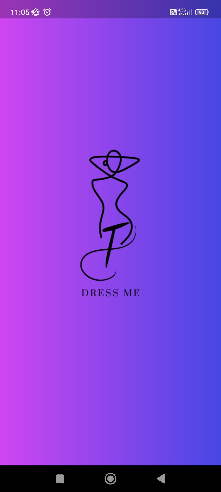
      </td>
      <td style="border: 1px solid #ccc; text-align: center;">
        
Login Screen

        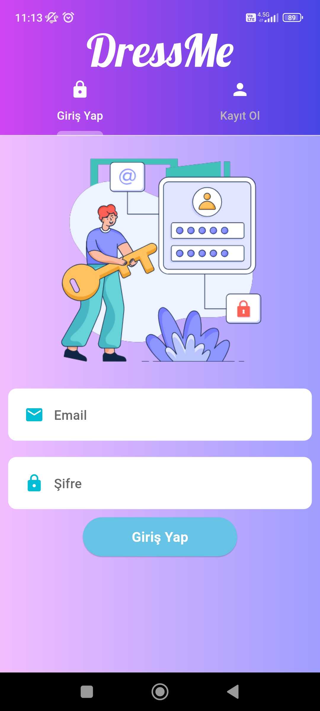
      </td>
      <td style="border: 1px solid #ccc; text-align: center;">
        
Register Screen

        
      </td>
      </tr>
      <tr>
      <td style="border: 1px solid #ccc; text-align: center;">
        
Home Screen

        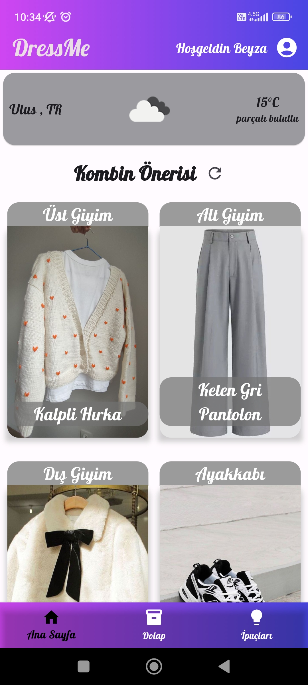
      </td>
      <td style="border: 1px solid #ccc; text-align: center;">
        
Home Screen 2

        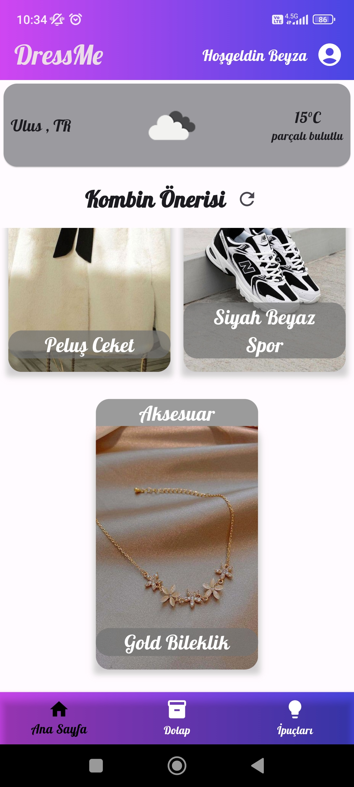
      </td>
      <td style="border: 1px solid #ccc; text-align: center;">
        
Cupboard Screen

        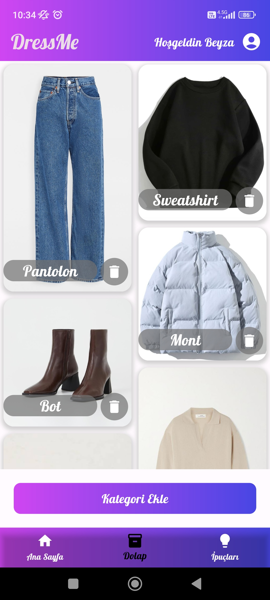
      </td>
      </tr>
      <tr>
      <td style="border: 1px solid #ccc; text-align: center;">
        
Add New Category

        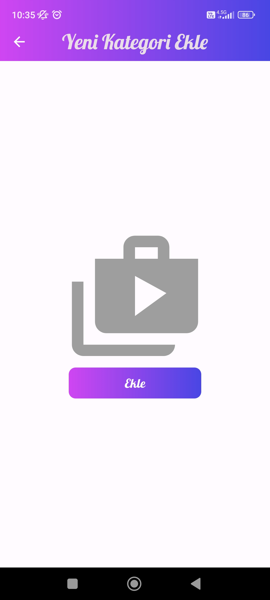
      </td>
      <td style="border: 1px solid #ccc; text-align: center;">
        
Select Category Image

        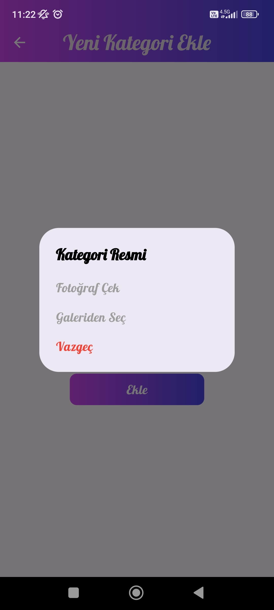
      </td>
      <td style="border: 1px solid #ccc; text-align: center;">
        
Tracks Screen

        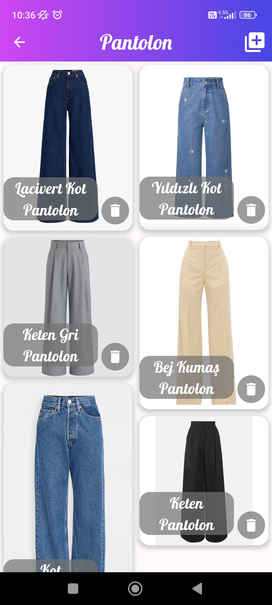
      </td>
            </tr>
            <tr>
            <td style="border: 1px solid #ccc; text-align: center;">
        
Add New Track

        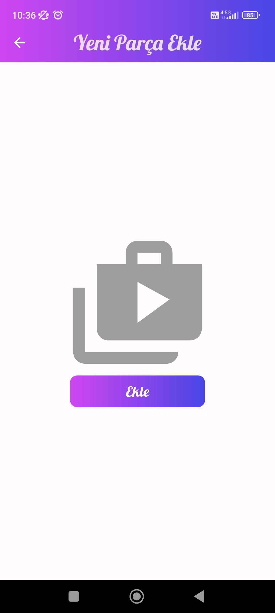
      </td>
      <td style="border: 1px solid #ccc; text-align: center;">
        
Select Track Image

        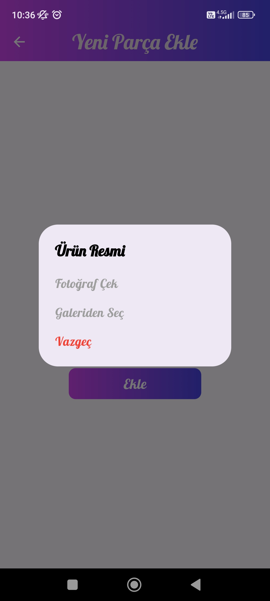
      </td>
      <td style="border: 1px solid #ccc; text-align: center;">
        
Select Track Properties

        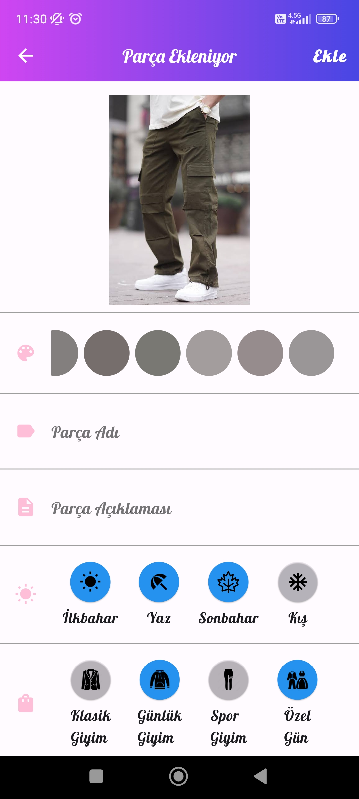
      </td>
      </tr>
      <tr>
      <td style="border: 1px solid #ccc; text-align: center;">
        
Tips Screen

        
      </td>
      <td style="border: 1px solid #ccc; text-align: center;">
        
Tips Screen 2

        
      </td>
      <td style="border: 1px solid #ccc; text-align: center;">
        
Profil Screen

        
      </td>
      </tr>
      <tr>
      <td style="border: 1px solid #ccc; text-align: center;">
        
Change Password Screen

        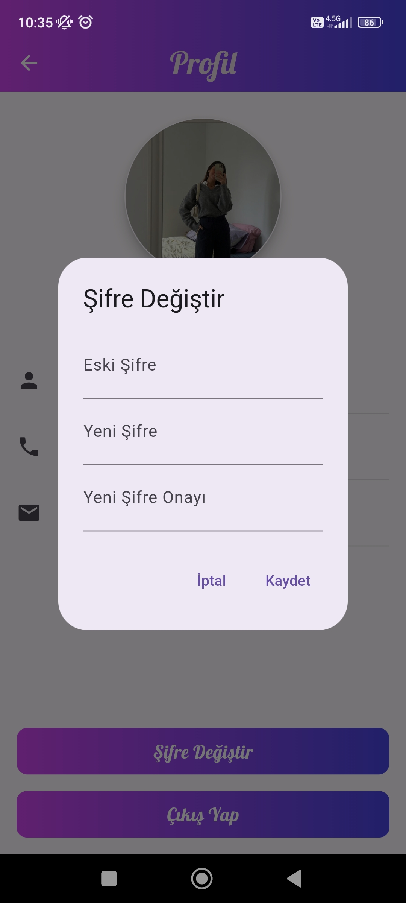
      </td>
      <td style="border: 1px solid #ccc; text-align: center;">
        
Logout Screen

        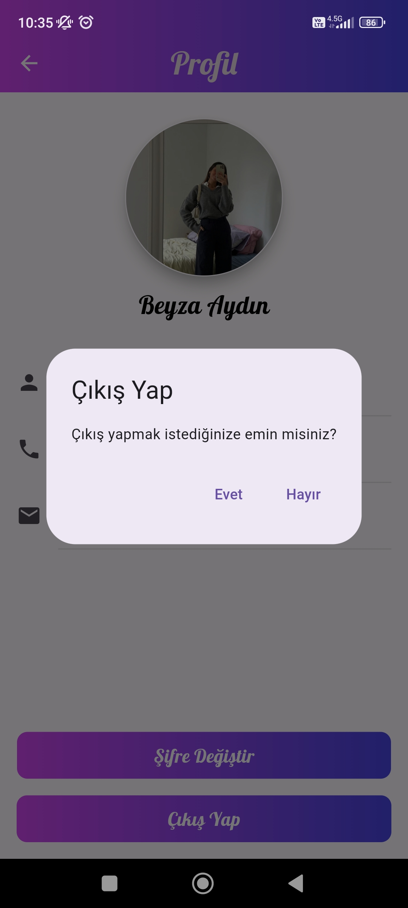
      </td>
      </tr>      
  </table>

