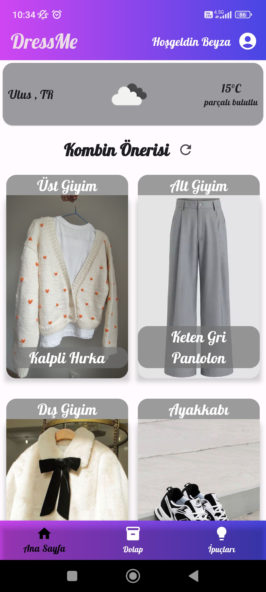
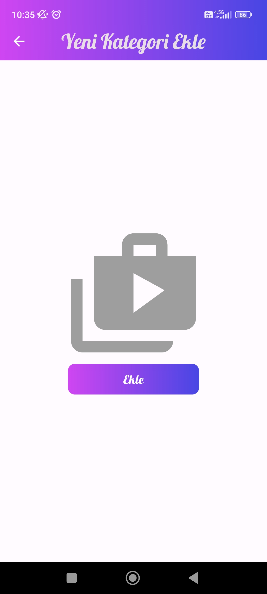
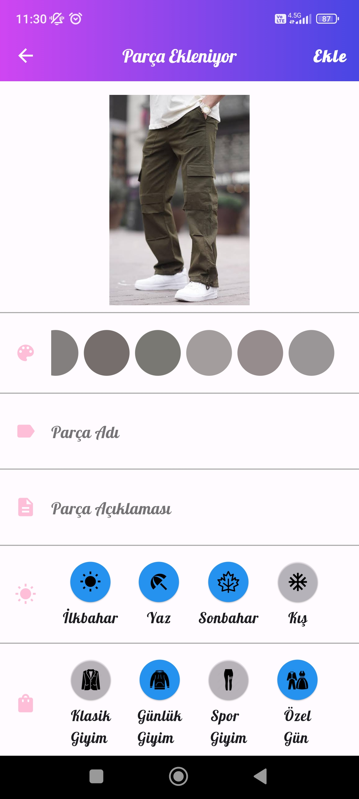



# DressMe
| [İnglizce](/README.md) | [Türkçe](./README_TR.md) |

DressMe, kullanıcıların giysilerini uygun kombinler oluşturmalarına yardımcı olmak için tasarlanmış bir mobil uygulamadır. Uygulama, kullanıcıların dolaplarındaki giysi öğelerinin renk ve desen bilgilerini fotoğraflayarak analiz eder ve hava koşullarına göre kişiselleştirilmiş kıyafet önerileri sunar. Ayrıca, kullanıcıların dolaplarına eklemeleri gereken öğeleri 'eksik parçalar' olarak kategorize eder ve öneriler sunar.

Giysi Tüyoları sayfasında, kullanıcılar giysilerini daha iyi nasıl düzenleyecekleri, yeni giysiler satın alırken nelere dikkat etmeleri gerektiği, mevcut sezonun trend parçaları ve daha iyi giyinme ipuçları hakkında bilgilendirici içerik bulacaklar. Bu şekilde, kullanıcılar yalnızca kombinler oluşturmazlar, aynı zamanda giysiler hakkında genel bilgi edinirler.

## Proje Özellikleri

- __Firebase Auth__ : 
Kullanıcının kimliğini değiştirmek için kullanıldı.
- __Cloud Firestore__ : 
Uygulama verilerini depolamak ve senkronize etmek için kullanılan Firebase'in bulut tabanlı NoSQL veritabanıdır.
- __Firebase Storage__ : 
Firebase bulut depolama hizmetini kullanarak dosyaları depolamak için kullanıldı.
- __Firebase App Check__ : Bu yazılım, uygulamanın güvenliğini artırmak için kullanıldı. Otomatik olarak cihazları doğrular ve güvenilir kabul eder.
- __Lottie__ : 
It was used to add animations to Flutter applications.
- __Image Picker__ : 
Flutter uygulamalarına animasyonlar eklemek için kullanıldı.
- __Flutter Staggered Grid View__ : 
Düzenleme seçenekleri sunan ızgara görünümü için kullanıldı.
- __Fluttertoast__ : Uygulamada mesajları göstermek için toast kullanıldı.

- __Font Awesome Flutter__ : Flutter uygulamalarında simgeleri kullanmak için kullanıldı.
- __Palette Generator__ : Görüntülerden renk paleti oluşturarak, tasarım uyumluluğunu sağlamak için kullanıldı.
- __Permission Handler__ : 
Android ve iOS'ta izinleri yönetmek için kullanıldı.
- __Geolocator__ : Cihazın konumunu almak ve yönetmek için kullanıldı.
- __Image__ : Görüntü işleme ve gösterimi için kullanıldı.
- __Provider__ : 
Flutter uygulamalarında durum yönetimi ve veri akışı kontrolü için kullanıldı.
- __Shared Preference__ : Basit veri depolama için kullanıldı.
- __Geocoding__ : 
Adres ve konum bilgilerini almak ve işlemek için kullanıldı.

## Screens

  <table>
  <tr>
      <td style="border: 1px solid #ccc; text-align: center;">
        
Splash Ekranı

        
      </td>
      <td style="border: 1px solid #ccc; text-align: center;">
        
Giriş Ekranı

        
      </td>
      <td style="border: 1px solid #ccc; text-align: center;">
        
Kayıt Ekranı

        
      </td>
      </tr>
      <tr>
      <td style="border: 1px solid #ccc; text-align: center;">
        
Anasayfa

        
      </td>
      <td style="border: 1px solid #ccc; text-align: center;">
        
Anasayfa 2

        
      </td>
      <td style="border: 1px solid #ccc; text-align: center;">
        
Dolap Ekranı

        
      </td>
      </tr>
      <tr>
      <td style="border: 1px solid #ccc; text-align: center;">
        
Yeni Kategori Ekle

        
      </td>
      <td style="border: 1px solid #ccc; text-align: center;">
        
Kategori Resmi Seç

        
      </td>
      <td style="border: 1px solid #ccc; text-align: center;">
        
Parça Ekranı

        
      </td>
            </tr>
            <tr>
            <td style="border: 1px solid #ccc; text-align: center;">
        
Yeni Parça Ekle

        
      </td>
      <td style="border: 1px solid #ccc; text-align: center;">
        
Parça Resmi Seç

        
      </td>
      <td style="border: 1px solid #ccc; text-align: center;">
        
Parça Özellikleri Seç

        
      </td>
      </tr>
      <tr>
      <td style="border: 1px solid #ccc; text-align: center;">
        
İpucu Ekranı

        
      </td>
      <td style="border: 1px solid #ccc; text-align: center;">
        
İpucu Ekranı 2

        
      </td>
      <td style="border: 1px solid #ccc; text-align: center;">
        
Profil Ekranı

        
      </td>
      </tr>
      <tr>
      <td style="border: 1px solid #ccc; text-align: center;">
        
Şifre Değiştirme Ekranı

        
      </td>
      <td style="border: 1px solid #ccc; text-align: center;">
        
Çıkış Yap Ekranı

        
      </td>
      </tr>      
  </table>

